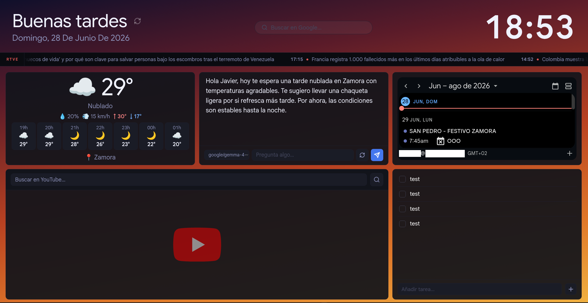

# display4theday




A self-hosted, always-on dashboard designed for a wall-mounted display (Raspberry Pi or any Linux box). One Node/Express process, no build step, no database — state lives in flat JSON files.

Panels:

- **Weather** — current conditions + hourly forecast via [Open-Meteo](https://open-meteo.com/) (no API key required)
- **Google Calendar** — next 7 days of events via OAuth2 or a Google Calendar embed URL
- **News** — scrolling ticker from configurable RSS feeds, 10-minute server-side cache
- **Todos** — full create / edit / delete via the UI, persisted in `todos.json`
- **Media** — embeds any iframe-compatible URL (YouTube, Spotify, local streams…) plus an in-panel YouTube search box
- **AI assistant** — local LLM via [Ollama](https://ollama.com/) or [LM Studio](https://lmstudio.ai/), context-aware of the calendar and weather; degrades gracefully when no backend is configured

Security: strict Content-Security-Policy (no `unsafe-inline`), `helmet` headers, per-endpoint rate limiting, optional authentication via shared password (`AUTH_MODE=password`) or Keycloak OIDC (`AUTH_MODE=keycloak`).

## Requirements

- **Node.js ≥ 18**
- Optionally: Ollama or LM Studio for the AI panel
- Optionally: a Google Cloud project with the Calendar API + OAuth 2.0 Web client for live calendar sync
- Optionally: a YouTube Data API v3 key for the YouTube search box
- Optionally: a Keycloak realm for OIDC authentication

## Quick start

```bash
git clone <your-fork-url> display4theday
cd display4theday
npm install
cp .env.example .env
$EDITOR .env        # fill in the values you need
npm start
```

Then open <http://localhost:3000>.

This is intended to run **permanently as a systemd service** so the dashboard survives reboots. See [Running as a systemd service](#running-as-a-systemd-service) once you have confirmed the basic setup works.

## Configuration

All configuration is read from environment variables (or a `.env` file, loaded via `dotenv`).

### Server

| Variable               | Default       | Description                                                              |
| ---------------------- | ------------- | ------------------------------------------------------------------------ |
| `PORT`                 | `3000`        | HTTP port                                                                |
| `HOST`                 | `127.0.0.1`   | Bind address. Set to `0.0.0.0` to expose on the local network            |
| `DATA_DIR`             | _cwd_         | Directory for `todos.json` (useful in tests)                             |
| `TRUST_PROXY`          | —             | Number of reverse-proxy hops to trust for `X-Forwarded-*` headers (`1` behind Nginx/Caddy) |
| `WEATHER_DEFAULT_LAT`  | `0`           | Default latitude for the weather panel (used before the browser shares location) |
| `WEATHER_DEFAULT_LON`  | `0`           | Default longitude                                                        |
| `WEATHER_DEFAULT_CITY` | `Sin ubicación` | Display name shown before geolocation resolves                         |

### Google Calendar (optional)

Paste the embed URL from Google Calendar settings into `GOOGLE_CALENDAR_EMBED_URL`. No OAuth or API key required — the calendar is rendered in an iframe.

| Variable                    | Default | Description                                             |
| --------------------------- | ------- | ------------------------------------------------------- |
| `GOOGLE_CALENDAR_EMBED_URL` | —       | `https://calendar.google.com/calendar/embed?src=…` URL |

To get the URL: Google Calendar → Settings → your calendar → "Integrate calendar" → copy the `src` attribute from the embed code.

### AI assistant (optional)

Set `AI_BACKEND` to one of:

| Value      | Required env vars                                                  | Notes                             |
| ---------- | ------------------------------------------------------------------ | --------------------------------- |
| `none`     | (none)                                                             | Default. `/api/ai/*` returns 503. |
| `ollama`   | `OLLAMA_HOST`, `OLLAMA_MODEL`                                      | Uses the `ollama` package.        |
| `lmstudio` | `LM_STUDIO_HOST`, `LM_STUDIO_MODEL` (optional `LM_STUDIO_API_KEY`) | Talks OpenAI-compatible HTTP API. |

Plus, regardless of the backend:

| Variable         | Default   | Description                                                             |
| ---------------- | --------- | ----------------------------------------------------------------------- |
| `OWNER_NAME`     | _(empty)_ | Personalises the AI system prompt ("asistente personal del panel de X") |
| `OWNER_LANGUAGE` | `español` | Language the AI assistant responds in                                   |

### Media

| Variable           | Default   | Description                                                                                          |
| ------------------ | --------- | ---------------------------------------------------------------------------------------------------- |
| `MEDIA_IFRAME_URL` | _(empty)_ | Default URL for the media panel (YouTube watch / playlist, Spotify embed, or any iframe-allowed URL) |
| `YOUTUBE_API_KEY`  | _(empty)_ | YouTube Data API v3 key for the search box                                                           |

### Authentication (optional)

Set `AUTH_MODE` to select a strategy:

| `AUTH_MODE` | Description |
| ----------- | ----------- |
| _(unset)_   | No auth. Dashboard is open to whoever can reach the port. |
| `password`  | Single shared password. Simple option for a trusted LAN. |
| `keycloak`  | Full OIDC login via a Keycloak realm. Multi-user ready. |

#### Shared password (`AUTH_MODE=password`)

| Variable              | Required? | Description                                                              |
| --------------------- | --------- | ------------------------------------------------------------------------ |
| `DASHBOARD_PASSWORD`  | yes       | The password (plaintext or a `$scrypt$…` hash — see `npm run hash-password`) |
| `SESSION_SECRET`      | yes       | 32+ random bytes for signing the session cookie. `openssl rand -hex 32` |
| `SESSION_COOKIE_SECURE` | no      | `true` when serving over HTTPS                                           |

Generate a secure password hash:

```bash
npm run hash-password mypassword
# → $scrypt$...   (paste this into DASHBOARD_PASSWORD)
```

#### Keycloak / OIDC (`AUTH_MODE=keycloak`)

| Variable                 | Required? | Description                                                          |
| ------------------------ | --------- | -------------------------------------------------------------------- |
| `KEYCLOAK_ISSUER`        | yes       | OIDC issuer URL, e.g. `https://localhost:8443/realms/display4theday` |
| `KEYCLOAK_CLIENT_ID`     | yes       | OIDC client id                                                       |
| `KEYCLOAK_CLIENT_SECRET` | yes       | OIDC client secret                                                   |
| `KEYCLOAK_REDIRECT_URI`  | yes       | Callback URL, e.g. `http://localhost:3000/auth/keycloak/callback`    |
| `SESSION_SECRET`         | yes       | 32+ random bytes for signing the session cookie. `openssl rand -hex 32` |
| `SESSION_COOKIE_SECURE`  | no        | `true` when serving over HTTPS                                       |

## Keycloak setup (`AUTH_MODE=keycloak`)

1. **Create a realm** (e.g. `display4theday`) in your Keycloak admin console.
2. **Create a user** in that realm.
3. **Create a client**:
   - Client type: `OpenID Connect`
   - Client ID: `display4theday`
   - Client authentication: ON (confidential client)
   - Valid redirect URIs: `http://localhost:3000/auth/keycloak/callback`
   - Web origins: `+` (or list the dashboard origin)
4. Copy the client secret into `KEYCLOAK_CLIENT_SECRET`.
5. Set `AUTH_MODE=keycloak` and the rest of the `KEYCLOAK_*` variables in `.env`.
6. Restart the server. Visiting the dashboard now redirects to Keycloak.
7. Visit `/auth/keycloak/user` to verify the session.
8. Visit `/auth/keycloak/logout` to log out (RP-initiated logout).

If Keycloak uses a self-signed certificate, export the CA and set:
```bash
NODE_EXTRA_CA_CERTS=/path/to/keycloak-ca.pem
```
(either in `.env` or in the systemd unit's `Environment=` line).

## Running as a systemd service

A unit file is provided as `display4theday.service`. Edit the following fields before installing:

- `User=` — the unprivileged user that will run the service
- `WorkingDirectory=` — absolute path to the cloned repo
- `ExecStart=` — adjust the `node` binary path if needed (e.g. `nvm`/`fnm` users)

Then:

```bash
sudo cp display4theday.service /etc/systemd/system/display4theday.service
sudo systemctl daemon-reload
sudo systemctl enable --now display4theday
sudo journalctl -u display4theday -f
```

When `AUTH_MODE` is set, place the dashboard behind a TLS-terminating reverse
proxy (Nginx, Caddy, Traefik…) so that the session cookie can be marked
`Secure`. Set `SESSION_COOKIE_SECURE=true` and `TRUST_PROXY=1` in `.env`.

## Project layout

```
.
├── server.js              # Express app + API routes
├── auth/
│   ├── index.js           # Auth orchestrator (selects mode)
│   ├── keycloak.js        # OIDC/Keycloak middleware (AUTH_MODE=keycloak)
│   ├── password.js        # Shared-password middleware (AUTH_MODE=password)
│   └── limiters.js        # Rate-limit factories for auth endpoints
├── ai/                    # AI backend abstraction (ollama | lmstudio | none)
│   └── backend.js
├── public/                # Static frontend (no build step)
│   ├── index.html
│   ├── app.js
│   ├── ui.js
│   ├── style.css
│   ├── modules/           # One file per dashboard widget
│   └── lib/               # Vendored third-party libs (gsap)
├── scripts/
│   ├── hash-password.mjs  # Generate a $scrypt$ hash for DASHBOARD_PASSWORD
│   └── patch-oauth4webapi.mjs  # Postinstall fix for oauth4webapi crypto import
├── test/                  # node:test suite (no extra dependencies)
│   ├── server.test.js
│   ├── auth.test.js
│   ├── auth-rate-limit.test.js
│   ├── password-auth.test.js
│   ├── calendar-embed.test.js
│   ├── ai-backend.test.js
│   └── util.test.js
├── download-gsap.sh       # Re-fetches the vendored gsap files
├── display4theday.service # systemd unit template
├── eslint.config.js
├── .prettierrc
├── .env.example
├── CHANGELOG.md
└── package.json
```

## Data files

- `todos.json` — Todo items. Created on first write, gitignored.

Lives in `DATA_DIR` (defaults to the project root), written with mode `0600`.

## Development

```bash
npm run dev           # node --watch server.js
npm test              # runs the node:test suite
npm run lint          # ESLint
npm run lint:fix      # ESLint with --fix
npm run format        # Prettier write
npm run format:check  # Prettier check (CI-friendly)
```

The test suite uses Node's built-in test runner and does not require any
extra runtime dependencies. It boots the Express app on an ephemeral port
and exercises the API directly. External services (Nominatim, the AI
backend, etc.) are stubbed via `globalThis.fetch` discriminators so the
suite is hermetic.

## Security

- **Never commit `.env` or `tokens.json`** — both are gitignored.
- The OAuth flow stores tokens on disk; protect the host filesystem
  accordingly.
- The YouTube API key is read by the server and never sent to the client
  (search is proxied).
- The AI backend (`OLLAMA_HOST` / `LM_STUDIO_HOST`) is exposed to the
  local network by default; put it behind a reverse proxy with auth if
  you expose the dashboard.
- All responses carry the standard `helmet` security headers plus a
  strict CSP that bans inline scripts. The only third-party origins
  whitelisted are the Google APIs, Nominatim, Open-Meteo, YouTube, and
  Spotify.
- `/api/ai/chat` is rate-limited to 10 requests/minute per client;
  `/api/youtube/search` to 30/minute; the `/auth/*` and `/api/todo*`
  endpoints have their own limiters.
- When `AUTH_MODE` is set, the entire dashboard (frontend and API) is
  gated behind a login. Sessions are stored in a signed cookie
  (`SESSION_SECRET`) and expire after 24 hours (password mode) or until
  Keycloak logout (keycloak mode).
- The `id_token` JWT is stored server-side (not in the cookie) to keep
  the cookie under the 4 KB browser limit.
- `tokens.json` and `todos.json` are written with `mode 0o600` (the
  server re-applies `chmod 0o600` on existing files on save).

### File and backup hygiene

After cloning, run once:

```bash
chmod 600 .env tokens.json todos.json 2>/dev/null || true
chmod +x download-gsap.sh
```

`tokens.json` and `id-tokens.json` (when using Keycloak) contain
**long-lived OAuth credentials** in plaintext. If you back up the host,
ensure the backup destination is encrypted (restic, borg, duplicity, or
equivalent). Restoring an old `tokens.json` together with new `todos.json`
won't cause data loss, but the tokens themselves grant the holder
access to the linked Google account until manually revoked.

### Public release checklist

If you fork or mirror this repo to a public host, run through this list before pushing:

1. Confirm no secrets are tracked:
   ```bash
   git ls-files | grep -E 'tokens\.json|^\.env$|secrets/'   # should print nothing
   git log --all --full-history -- tokens.json .env          # should be empty
   ```
2. **Revoke the Google OAuth `refresh_token`** that lives in
   `tokens.json` before sharing the host or any backup of it. The file
   is gitignored, but a leaked host snapshot would expose a long-lived
   credential. Revoke at <https://myaccount.google.com/permissions>
   (look for "display4theday" or your OAuth client name) and
   re-authorise after the move.
3. Confirm any local dev tooling config files are gitignored and not tracked:
   ```bash
   git ls-files | grep -E 'CLAUDE\.md|AGENTS\.md|GEMINI\.md|\.optimia'
   # should print nothing
   ```
4. Rotate any API keys that ever lived on the host:
   `GOOGLE_CLIENT_SECRET`, `YOUTUBE_API_KEY`, `KEYCLOAK_CLIENT_SECRET`,
   `SESSION_SECRET`.

## Contributing

This project is in beta. Bug reports, ideas, and pull requests are welcome.

- Open an issue to report a bug or suggest a feature before writing code
- Keep PRs focused — one thing per PR
- Run `npm test && npm run lint` before submitting

## License

[MIT](./LICENSE)
